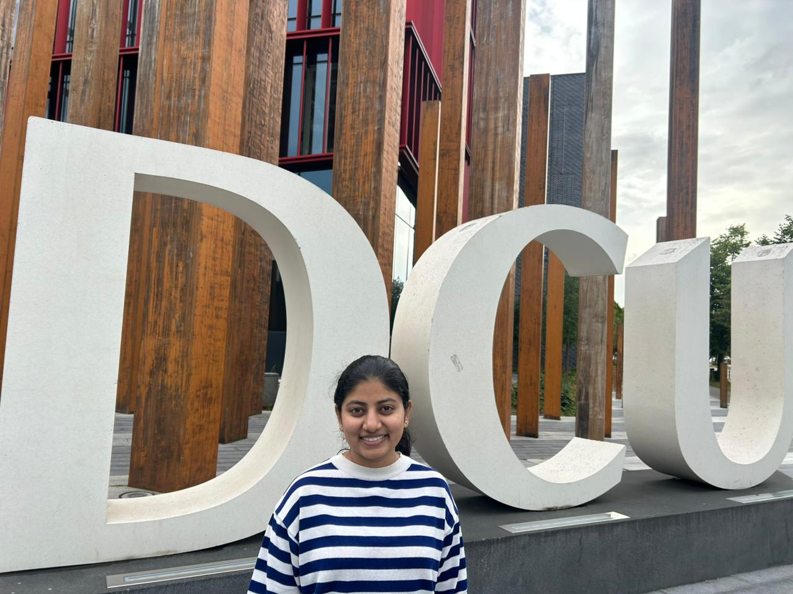

##  Get to Know Me

::: {style="display: flex; gap: 2rem; flex-wrap: wrap; align-items: flex-start; margin-bottom: 1.5rem;"}

::: {style="flex: 1; min-width: 280px;"}
I am a Business Analytics postgraduate student at **Dublin City University**, 
blending **2.7 years of industry experience** at Accenture with a passion for 
turning complex data into clear, actionable insights.

My journey reflects a deliberate transition, from enterprise consulting in India 
to advanced analytics in Ireland driven by curiosity and a belief that 
**evidence should drive every decision**.
:::

::: {style="flex: 0 0 auto;"}
{fig-alt="Ananya at Dublin City University" 
width="260px" style="border-radius: 12px; box-shadow: 0 4px 12px rgba(0,0,0,0.15);"}
:::

:::

---

##  Experience

::: {style="background: linear-gradient(135deg, #1a1a2e, #16213e); color: #fff; border-radius: 14px; padding: 1.5rem; margin-bottom: 1.2rem;"}
**Accenture — Analyst · 2022–2025 · India**

Telecom analytics and performance optimisation for global clients — **Vodafone**, **Telstra**, **DISH**, and **British Telecommunications**.

- Analysed large datasets to support business reporting  
- Built dashboards and workflows to reduce manual effort  
- Defined KPIs and supported cross-functional decision-making  
- Strong stakeholder communication in a fast-paced environment
:::

::: {style="background: linear-gradient(135deg, #0f3460, #533483); color: #fff; border-radius: 14px; padding: 1.5rem; margin-bottom: 1.2rem;"}
**Centra — Deli Assistant · Jan 2026–Present · Dublin**

Balancing postgraduate studies with part-time work has sharpened my **time management, resilience, and adaptability** — skills as valuable as any technical ability.

- Consistent delivery in a fast-paced customer environment  
- Reliable team player under competing priorities  
- Demonstrates commitment and real-world work ethic alongside studies
:::

::: {style="background: linear-gradient(135deg, #2d6a4f, #1b4332); color: #fff; border-radius: 14px; padding: 1.5rem; margin-bottom: 1.2rem;"}
**MSc Business Analytics · Dublin City University · 2025–Present**

Postgraduate study focused on machine learning, data visualisation, and applied analytics — bridging business strategy with technical depth.

- Core modules: ML, Data Visualisation, Business Intelligence  
- Final year project: applied analytics and Python modelling  
- Built this portfolio as part of coursework using Quarto and GitHub Pages
:::

---

##  Skills

```{=html}
<div style="max-width: 650px; margin: 1rem 0;">

  <div style="margin-bottom: 1.2rem;">
    <div style="display: flex; justify-content: space-between; margin-bottom: 4px;">
      <span style="font-weight: 600;">Python (Pandas, Plotly, Scikit-learn)</span>
      <span style="color: #888;">Advanced</span>
    </div>
    <div style="background: #e9ecef; border-radius: 6px; height: 10px;">
      <div style="width: 85%; background: linear-gradient(90deg, #1a1a2e, #c9a84c); height: 10px; border-radius: 6px;"></div>
    </div>
  </div>

  <div style="margin-bottom: 1.2rem;">
    <div style="display: flex; justify-content: space-between; margin-bottom: 4px;">
      <span style="font-weight: 600;">SQL & Data Querying</span>
      <span style="color: #888;">Advanced</span>
    </div>
    <div style="background: #e9ecef; border-radius: 6px; height: 10px;">
      <div style="width: 80%; background: linear-gradient(90deg, #1a1a2e, #c9a84c); height: 10px; border-radius: 6px;"></div>
    </div>
  </div>

  <div style="margin-bottom: 1.2rem;">
    <div style="display: flex; justify-content: space-between; margin-bottom: 4px;">
      <span style="font-weight: 600;">Data Visualisation</span>
      <span style="color: #888;">Advanced</span>
    </div>
    <div style="background: #e9ecef; border-radius: 6px; height: 10px;">
      <div style="width: 80%; background: linear-gradient(90deg, #1a1a2e, #c9a84c); height: 10px; border-radius: 6px;"></div>
    </div>
  </div>

  <div style="margin-bottom: 1.2rem;">
    <div style="display: flex; justify-content: space-between; margin-bottom: 4px;">
      <span style="font-weight: 600;">Machine Learning</span>
      <span style="color: #888;">Intermediate</span>
    </div>
    <div style="background: #e9ecef; border-radius: 6px; height: 10px;">
      <div style="width: 60%; background: linear-gradient(90deg, #1a1a2e, #c9a84c); height: 10px; border-radius: 6px;"></div>
    </div>
  </div>

  <div style="margin-bottom: 1.2rem;">
    <div style="display: flex; justify-content: space-between; margin-bottom: 4px;">
      <span style="font-weight: 600;">Git & Version Control</span>
      <span style="color: #888;">Basic</span>
    </div>
    <div style="background: #e9ecef; border-radius: 6px; height: 10px;">
      <div style="width: 40%; background: linear-gradient(90deg, #1a1a2e, #c9a84c); height: 10px; border-radius: 6px;"></div>
    </div>
  </div>

  <div style="margin-bottom: 1.2rem;">
    <div style="display: flex; justify-content: space-between; margin-bottom: 4px;">
      <span style="font-weight: 600;">Business Communication</span>
      <span style="color: #888;">Advanced</span>
    </div>
    <div style="background: #e9ecef; border-radius: 6px; height: 10px;">
      <div style="width: 90%; background: linear-gradient(90deg, #1a1a2e, #c9a84c); height: 10px; border-radius: 6px;"></div>
    </div>
  </div>

</div>
```

---

##  What I Bring

::: {style="display: grid; grid-template-columns: repeat(auto-fit, minmax(200px, 1fr)); gap: 1rem; margin: 1rem 0;"}

::: {style="background: linear-gradient(135deg, #2c3e50, #3498db); color:#fff; border-radius: 10px; padding: 1.2rem; text-align: center;"}
** Analytical Thinking**  
Breaking complex problems into clear insights
:::

::: {style="background: linear-gradient(135deg, #8e44ad, #3498db); color:#fff; border-radius: 10px; padding: 1.2rem; text-align: center;"}
** Business Context**  
Connecting analysis to real decisions
:::

::: {style="background: linear-gradient(135deg, #16a085, #2c3e50); color:#fff; border-radius: 10px; padding: 1.2rem; text-align: center;"}
** Collaboration**  
Cross-functional team experience
:::

::: {style="background: linear-gradient(135deg, #c0392b, #8e44ad); color:#fff; border-radius: 10px; padding: 1.2rem; text-align: center;"}
** Continuous Growth**  
Always learning, always adapting
:::

:::

---

##  Beyond Analytics

Outside work and study, I enjoy painting, badminton, carrom, and exploring 
new cultures and places, keeping me creative, grounded, and curious.

::: {.callout-note appearance="minimal" icon=false}
** Looking Ahead** — One of my long-term aspirations is to return to my school 
or college as a guest speaker, sharing my journey to encourage students to believe 
in growth, persistence, and the power of learning by doing.
:::