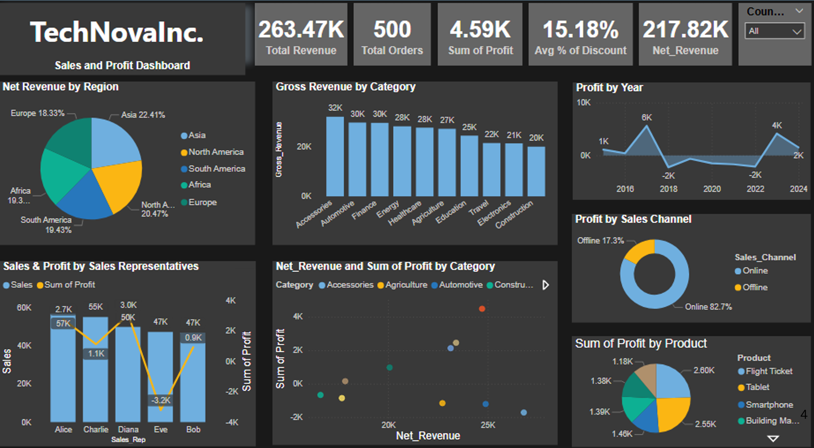

## 📌 Project Overview

This project presents a business performance analysis of TechNova Inc using Power BI dashboards.

The objective is to evaluate revenue trends, profitability patterns, and operational performance across regions, products, and sales channels to support data-driven decision-making.

---

## 📊 Dashboard Preview

---

::: {.callout-tip}
This dashboard enables real-time monitoring of business performance and supports strategic decision-making.
:::

---

## 📊 Key Business Metrics

- Total Revenue: **263.47K**
- Net Revenue: **217.82K**
- Total Profit: **4.59K**
- Total Orders: **500**
- Average Discount: **15.18%**

👉 The relatively low profit margin suggests potential inefficiencies in pricing or cost structures.

---

## 📈 Revenue Analysis

- Revenue peaked in **2017 (~31K)**  
- Decline observed during **2018–2020**  
- Recovery seen in **2023**  
- Drop observed again in **2024**

👉 This pattern indicates fluctuating business performance with signs of recovery in recent years.

---

## 🌍 Regional Insights

- Strong markets: **Asia, North America**
- Growth opportunities: **South America, Africa**
- Underperforming region: **Europe**

👉 Some regions generate high revenue but lower profit, indicating pricing or cost inefficiencies.

---

## 🛍️ Product Performance

Top contributors:
- Flight Tickets (~24.6%)
- Tablets (~24.2%)

Moderate contributors:
- Smartphones
- Building Materials
- Solar Panels (~13% each)

Lower contributors:
- Insurance Plans (~11%)

👉 Revenue concentration in a few categories suggests dependency on specific product segments.

---

## 📉 Profit Trend Analysis

- Peak profit in **2017 (~5.6K)**
- Loss period: **2018–2022**
- Recovery in **2023–2024**

👉 Indicates operational challenges followed by improved performance in later years.

## 🛒 Sales Channel Insights

- Online sales: **82.7% of total profit**
- Offline sales: **17.3%**

👉 Digital channels significantly outperform offline sales in profitability.

## 👥 Sales Representative Insights

- Top performers: **Alice & Diana**
- Some representatives generate high sales but low profit

👉 High sales volume does not always translate into high profitability.

## 💡 Key Insights

- Profit margins are relatively low compared to revenue  
- Revenue is concentrated in limited product categories  
- Online sales dominate profitability  
- Regional performance varies significantly  
- Sales performance does not always equal profitability  

## 🚀 Business Impact

- Improved visibility of revenue and profit trends  
- Better understanding of regional performance  
- Identification of cost and pricing inefficiencies  
- Supports data-driven strategic decision-making  

## 🏁 Conclusion

The analysis highlights both strengths and inefficiencies in TechNova’s business performance.

Focusing on high-margin products, optimizing pricing strategies, and strengthening digital sales channels can significantly improve long-term profitability and operational efficiency.